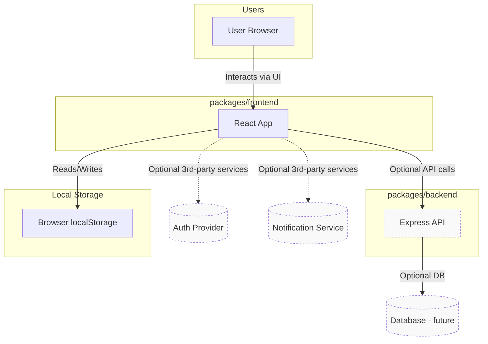
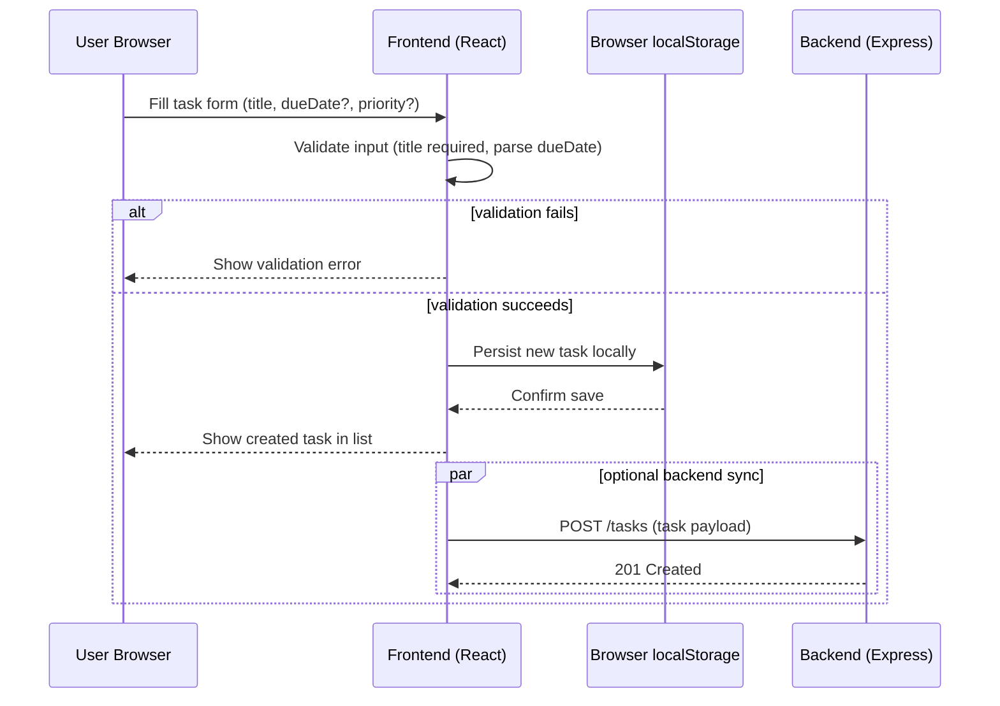

# Cloud Architecture Overview

This repository is a monorepo with a React frontend (`packages/frontend`) and a simple Express backend (`packages/backend`). The MVP is intentionally local-first (frontend uses localStorage) and does not require cloud services. Below is a simple system-context diagram showing the main components and optional future cloud integrations.

Notes

- MVP: frontend only, localStorage for persistence. No backend or cloud required.
- Post-MVP: backend (`packages/backend`) can be enabled to provide persistent storage, multi-user support, and integrations (auth, notifications).

## Sequence: Create TODO

The sequence below shows a typical "Create TODO" flow in the MVP (local-first), and the optional backend interaction for Post-MVP.

Notes

- In the MVP, the flow ends with localStorage persistence and immediate UI update.
- In Post-MVP, the frontend may also send the task to the backend (`packages/backend`) for centralized storage and multi-user syncing.

